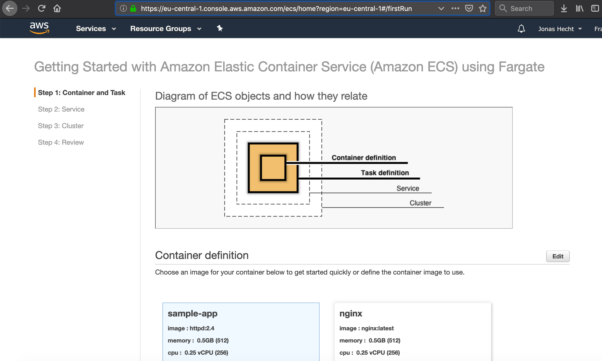
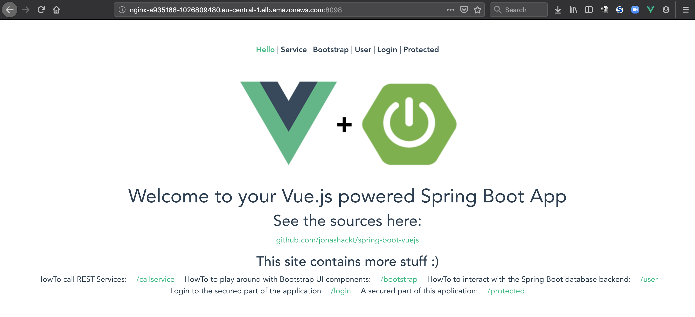

# pulumi-typescript-aws-fargate
[](https://travis-ci.org/jonashackt/pulumi-typescript-aws-fargate)
[](https://github.com/jonashackt/pulumi-typescript-aws-fargate/blob/master/LICENSE)
[](https://renovatebot.com)
[](https://www.pulumi.com/)

Example project showing how to run Dockerized spring-boot-vuejs with Pulumi on AWS Fargate based on AWS ECS

There's some confusion about AWS ECS, EKS & Fargate - try to [read posts like this](https://cloudonaut.io/ecs-vs-fargate-whats-the-difference/).

The first contact with AWS Fargate is the AWS ECS console - access it via https://eu-central-1.console.aws.amazon.com/ecs/home?region=eu-central-1#/firstRun There's also a nice overview picture waiting:



Pulumi also provides an example tutorial:

https://www.pulumi.com/docs/tutorials/aws/ecs-fargate/


### Pulumi AWS Crosswalk 

https://www.pulumi.com/docs/guides/crosswalk/aws/

> A collection of libraries that use automatic well-architected best practices to make common infrastructure-as-code tasks in AWS easier and more secure

Import them by using the `awsx` packages:

```
import * as awsx from "@pulumi/awsx";
```

### Start with Pulumi template for Typescript & AWS

Let's create a Pulumi project by using a template again (remember to use a new directory with `mkdir dir`, otherwise pulumi won't generate the template project):

```
pulumi new aws-typescript --name pulumi-typescript-aws-fargate
```

This will result in some questions about your preferred project description, Pulumi stack name and the AWS region:

```
$ pulumi new aws-typescript --name pulumi-typescript-aws-fargate

 This command will walk you through creating a new Pulumi project.
 
 Enter a value or leave blank to accept the (default), and press <ENTER>.
 Press ^C at any time to quit.
 
 project description: (A minimal AWS TypeScript Pulumi program) Example project showing how to run Dockerized spring-boot-vuejs with Pulumi on AWS Fargate based on AWS ECS
 Created project 'pulumi-typescript-aws-fargate'
 
 Please enter your desired stack name.
 To create a stack in an organization, use the format <org-name>/<stack-name> (e.g. `acmecorp/dev`).
 stack name: (dev) dev
 Created stack 'dev'
 
 aws:region: The AWS region to deploy into: (us-east-1) eu-central-1
 Saved config
 
 Installing dependencies...
 
 
 > deasync@0.1.15 install /Users/jonashecht/dev/pulumi-typescript-aws-fargate/new/node_modules/deasync
 > node ./build.js
 
 `darwin-x64-node-12` exists; testing
 Binary is fine; exiting
 
 > grpc@1.21.1 install /Users/jonashecht/dev/pulumi-typescript-aws-fargate/new/node_modules/grpc
 > node-pre-gyp install --fallback-to-build --library=static_library
 
 [grpc] Success: "/Users/jonashecht/dev/pulumi-typescript-aws-fargate/new/node_modules/grpc/src/node/extension_binary/node-v72-darwin-x64-unknown/grpc_node.node" is installed via remote
 
 > @pulumi/aws@1.7.0 install /Users/jonashecht/dev/pulumi-typescript-aws-fargate/new/node_modules/@pulumi/aws
 > node scripts/install-pulumi-plugin.js resource aws v1.7.0
 
[resource plugin aws-1.7.0] installing
 
 > @pulumi/docker@0.17.4 install /Users/jonashecht/dev/pulumi-typescript-aws-fargate/new/node_modules/@pulumi/docker
 > node scripts/install-pulumi-plugin.js resource docker v0.17.4
 
 [resource plugin docker-0.17.4] installing
 Downloading plugin: 17.29 MiB / 17.29 MiB [========================] 100.00% 16s
 Moving plugin... done.
 
 > protobufjs@6.8.8 postinstall /Users/jonashecht/dev/pulumi-typescript-aws-fargate/new/node_modules/protobufjs
 > node scripts/postinstall
 
 added 197 packages from 295 contributors and audited 1566 packages in 31.223s
 found 0 vulnerabilities
 
 Finished installing dependencies
 
 Your new project is ready to go! ✨
 
 To perform an initial deployment, run 'pulumi up'
```

Now the project should be generated by Pulumi.


### Create a AWS loadbalancer & Fargate service from our app's Docker image

As we're using Typescript, we're coding inside the [index.ts](index.ts) file:

```typescript
import * as awsx from "@pulumi/awsx";

// Create a load balancer to listen for requests and route them to the container.
let loadbalancer = new awsx.lb.ApplicationListener("nginx", { port: 8098, protocol: "HTTP" });

// Define the service using the example Spring Boot Vue.js app from https://github.com/jonashackt/spring-boot-vuejs
let service = new awsx.ecs.FargateService("spring-boot-vuejs", {
    taskDefinitionArgs: {
        containers: {
            nginx: {
                image: "jonashackt/spring-boot-vuejs",
                memory: 512,
                portMappings: [ loadbalancer ],
            },
        },
    },
    desiredCount: 2,
});

// Export the URL so we can easily access it.
export const url = loadbalancer.endpoint.hostname;
```

Now try to fire it up with `pulumi up`! :)

But this time Pulumi showed the power of it's AWS crosswalk libraries! Pulumi creates all needed AWS ECS cluster SecurityGroups from egress over ingress to ingress for cluster-ssh. But all of these are also needed for loadbalancer, which is based on AWS EC2. And finally Pulumi creates the AWS Fargate Service and Taskdefintion incl. IAM roles, policies and CloudWatch log group:

```
$ pulumi up

Please choose a stack, or create a new one: dev
Previewing update (dev):

Updating (dev):

     Type                                          Name                                  Status       Info
 +   pulumi:pulumi:Stack                           pulumi-typescript-aws-fargate-dev     created
 +   ├─ awsx:x:ec2:SecurityGroup                   nginx                                 created
 +   │  └─ aws:ec2:SecurityGroup                   nginx                                 created
 +   ├─ awsx:x:ec2:Vpc                             default-vpc-accd9bc5                  created
 +   │  ├─ awsx:x:ec2:Subnet                       default-vpc-accd9bc5-public-1         created
 +   │  └─ awsx:x:ec2:Subnet                       default-vpc-accd9bc5-public-0         created
 +   ├─ awsx:x:ecs:FargateService                  spring-boot-vuejs                     created
 +   │  └─ aws:ecs:Service                         spring-boot-vuejs                     created
 +   ├─ awsx:x:ecs:FargateTaskDefinition           spring-boot-vuejs                     created
 +   │  ├─ aws:cloudwatch:LogGroup                 spring-boot-vuejs                     created
 +   │  ├─ aws:iam:Role                            spring-boot-vuejs-execution           created
 +   │  ├─ aws:iam:Role                            spring-boot-vuejs-task                created
 +   │  ├─ aws:iam:RolePolicyAttachment            spring-boot-vuejs-execution-9a42f520  created
 +   │  ├─ aws:iam:RolePolicyAttachment            spring-boot-vuejs-task-32be53a2       created
 +   │  ├─ aws:iam:RolePolicyAttachment            spring-boot-vuejs-task-fd1a00e5       created
 +   │  └─ aws:ecs:TaskDefinition                  spring-boot-vuejs                     created
 +   ├─ awsx:x:ecs:Cluster                         default-cluster                       created
 +   │  ├─ awsx:x:ec2:SecurityGroup                default-cluster                       created
 +   │  │  ├─ awsx:x:ec2:IngressSecurityGroupRule  default-cluster-ssh                   created
 +   │  │  │  └─ aws:ec2:SecurityGroupRule         default-cluster-ssh                   created
 +   │  │  ├─ awsx:x:ec2:IngressSecurityGroupRule  default-cluster-containers            created
 +   │  │  │  └─ aws:ec2:SecurityGroupRule         default-cluster-containers            created
 +   │  │  ├─ awsx:x:ec2:EgressSecurityGroupRule   default-cluster-egress                created
 +   │  │  │  └─ aws:ec2:SecurityGroupRule         default-cluster-egress                created
 +   │  │  └─ aws:ec2:SecurityGroup                default-cluster                       created
 +   │  └─ aws:ecs:Cluster                         default-cluster                       created
 +   └─ aws:lb:ApplicationLoadBalancer             nginx                                 created
 +      ├─ awsx:lb:ApplicationTargetGroup          nginx                                 created
 +      │  └─ aws:lb:TargetGroup                   nginx                                 created
 +      ├─ awsx:lb:ApplicationListener             nginx                                 created
 +      │  ├─ awsx:x:ec2:IngressSecurityGroupRule  nginx-external-0-ingress              created
 +      │  │  └─ aws:ec2:SecurityGroupRule         nginx-external-0-ingress              created
 +      │  ├─ awsx:x:ec2:EgressSecurityGroupRule   nginx-external-0-egress               created
 +      │  │  └─ aws:ec2:SecurityGroupRule         nginx-external-0-egress               created
 +      │  └─ aws:lb:Listener                      nginx                                 created
 +      └─ aws:lb:LoadBalancer                     nginx                                 created

Outputs:
    url: "nginx-a935168-1026809480.eu-central-1.elb.amazonaws.com"

Resources:
    + 36 created

Duration: 4m14s

Permalink: https://app.pulumi.com/jonashackt/pulumi-typescript-aws-fargate/dev/updates/3
```

This will take a while, you can have a look into the AWS ECS console at https://eu-central-1.console.aws.amazon.com/ecs/home?region=eu-central-1#/clusters and see Pulumi "working":


Also the `Task Definitions` give fine grained details for your app.

Have a look at the containers' logs, there you should see the example app [spring-boot-vuejs](https://github.com/jonashackt/spring-boot-vuejs) running:

```
pulumi logs --follow
```

Now access the provides url nginx-a935168-1026809480.eu-central-1.elb.amazonaws.com:8098 with the port defined inside the `loadbalancer` defintion and you should see our app:


