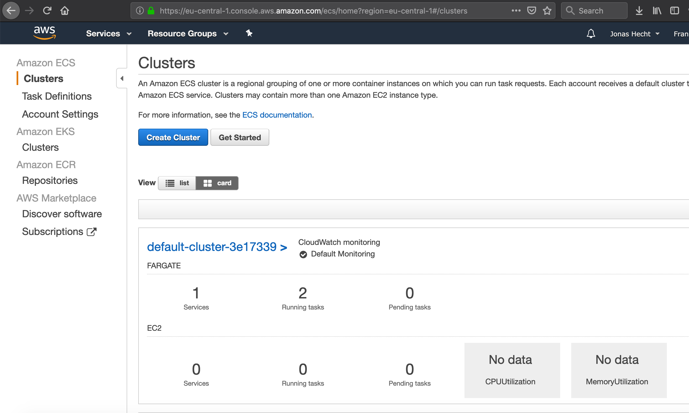

# pulumi-typescript-aws-fargate
[](https://travis-ci.org/jonashackt/pulumi-typescript-aws-fargate)
[](https://github.com/jonashackt/pulumi-typescript-aws-fargate/blob/master/LICENSE)
[](https://renovatebot.com)
[](https://www.pulumi.com/)

Example project showing how to run Dockerized spring-boot-vuejs with Pulumi on AWS Fargate based on AWS ECS

There's some confusion about AWS ECS, EKS & Fargate - try to [read posts like this](https://cloudonaut.io/ecs-vs-fargate-whats-the-difference/).

The first contact with AWS Fargate is the AWS ECS console - access it via https://eu-central-1.console.aws.amazon.com/ecs/home?region=eu-central-1#/firstRun There's also a nice overview picture waiting:



Pulumi also provides an example tutorial:

https://www.pulumi.com/docs/tutorials/aws/ecs-fargate/


### Pulumi AWS Crosswalk 

https://www.pulumi.com/docs/guides/crosswalk/aws/

> A collection of libraries that use automatic well-architected best practices to make common infrastructure-as-code tasks in AWS easier and more secure

Import them by using the `awsx` packages:

```
import * as awsx from "@pulumi/awsx";
```

### Start with Pulumi, Typescript & AWS

Let's create a Pulumi project by using a template again (remember to use a new directory with `mkdir dir`, otherwise pulumi won't generate the template project):

```
pulumi new aws-typescript --name pulumi-typescript-aws-fargate
```

